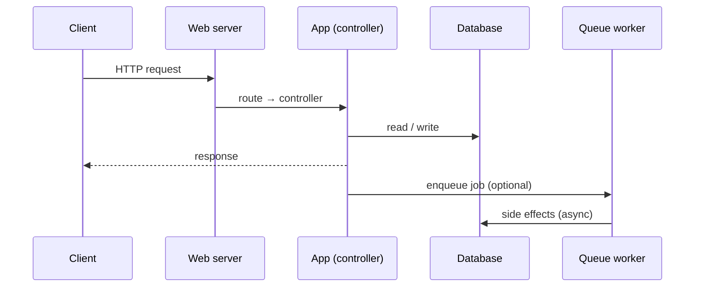

# Data flow

How a request becomes a response, and what happens on the side.

## Request lifecycle

## Synchronous path

1. Web server terminates TLS, forwards to the app.
2. Router matches against [endpoints](../reference/endpoints.md) and dispatches a controller.
3. Controller authorises (see [Auth](../reference/auth.md)), reads/writes the [data model](../reference/data-model.md), and renders.

## Asynchronous path

Anything slow or fail-tolerant is enqueued — see [Background jobs](../reference/jobs.md).

## Why this shape

See ADR [0001](decisions/0001-record-architecture-decisions.md) and follow-on entries in the [decisions log](decisions/index.md).
