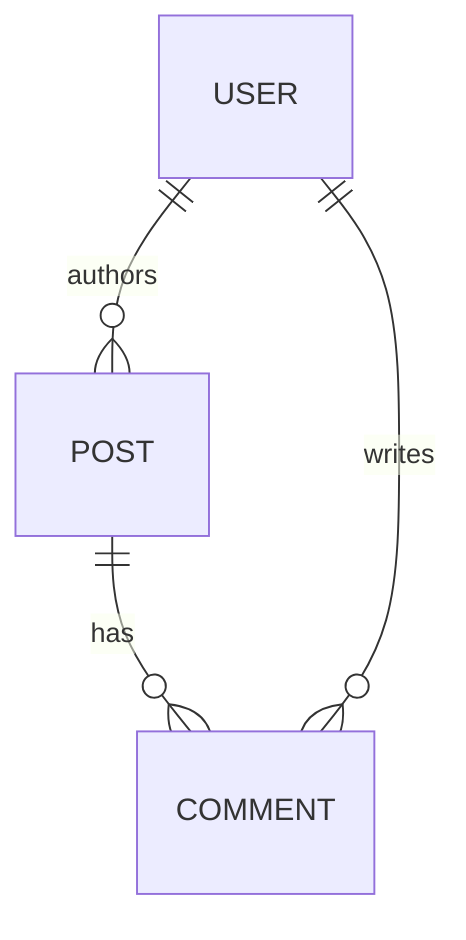

# Data model

Domain entities, their relationships and the underlying DB schema.

## Diagram

## Entities

### User

- **Table:** `users`
- **Key columns:** `id`, `email` (unique), `name`, `created_at`
- **Relationships:** has many `Post`, has many `Comment`
- **Used by:** [Auth](auth.md), [endpoints](endpoints.md)

### Post

- **Table:** `posts`
- **Key columns:** `id`, `user_id`, `title`, `body`, `published_at`
- **Relationships:** belongs to `User`, has many `Comment`

### Comment

- **Table:** `comments`
- **Key columns:** `id`, `post_id`, `user_id`, `body`, `created_at`
- **Relationships:** belongs to `Post`, belongs to `User`

## Migrations

Migrations live in `db/migrate` (Rails) or `database/migrations` (Laravel). Schema-changing PRs should:

- Add the migration
- Update this page
- Note the change in [Changelog](../changelog.md)
